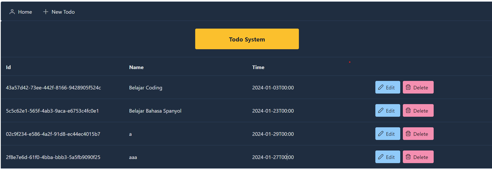

# Todo App

This is a simple Todo application built using JavaServer Faces (JSF) with PrimeFaces. The application allows users to manage their todo items with basic CRUD operations.

## Features

- View a list of todos
- Add a new todo
- Edit an existing todo
- Delete a todo

## Technologies Used

- JavaServer Faces (JSF)
- PrimeFaces
- [PrimeFlex](https://www.primefaces.org/primeflex/) for responsive layout

## Getting Started

To run this application locally, follow these steps:

1. Clone this repository:

    ```bash
    git clone <repository-url>
    ```

2. Deploy the application to a Java EE application server.

3. Access the application in your web browser.

## Usage

- Navigate to the Home page to view the list of todos.
- Click on "New Todo" to add a new todo.
- Use the "Edit" button to modify an existing todo.
- Click on "Delete" to remove a todo.

## Development

### Prerequisites

- Java EE application server (e.g., Apache Tomcat)
- Java Development Kit (JDK)
- IDE with JSF and Java support

### Development Server

1. Open the project in your preferred IDE.

2. Configure the Java EE application server.

3. Run the application on the development server.

4. Access the application in your web browser.

## Contributing

Contributions are welcome! Please follow the [contribution guidelines](CONTRIBUTING.md).

## License

This project is licensed under the [MIT License](LICENSE).

---

Feel free to customize this README to better suit your specific project structure and requirements. Include any additional information about the project setup, configuration, or deployment that may be relevant for users or contributors.
